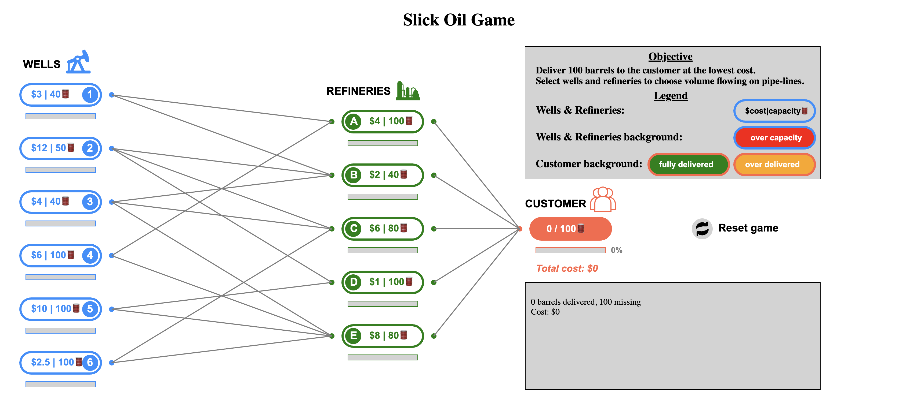
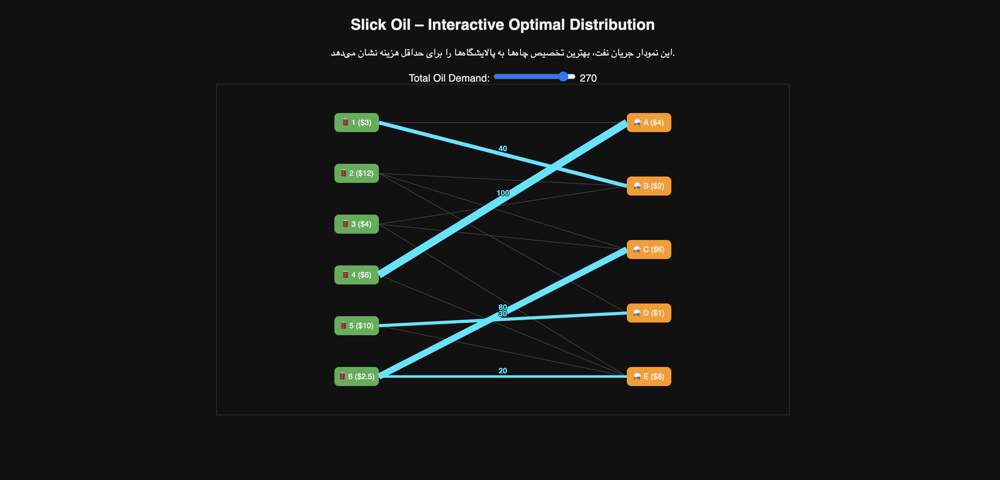

# Slick Oil – Bipartite Optimizer

## Welcome to Slick Oil!

Ever wondered how oil gets efficiently distributed from wells to refineries? Slick Oil is an interactive web-based visualization tool that brings this optimization puzzle to life. It shows you the smartest way to allocate oil flows, minimizing overall costs while respecting the capacities of both wells and refineries. And the best part? You can play around with the total oil demand using a slider and watch how the distribution adapts in real-time!

---

## What’s This All About?

At its core, Slick Oil solves a classic optimization problem using a clever algorithm. Imagine you have a bunch of wells pumping oil and several refineries ready to process it. Each connection between a well and a refinery has a cost and a limit on how much oil can flow through it. Slick Oil figures out the most cost-effective way to send oil from wells to refineries without exceeding these limits.

The algorithm works like a smart matchmaker: it pairs wells and refineries in a way that gets the job done for the lowest total cost. It’s kind of like finding the best routes on a map to save time and fuel, but here it’s about oil and money. This approach ensures that no oil is wasted and no refinery is overwhelmed, all while keeping costs down.

---

```

Step 1: Compute costs for each connection
Step 2: Sort all connections by cost (cheapest first)
Step 3: Allocate barrels along cheapest available routes first,
        respecting well and refinery capacities.
```

## Try It Yourself!

- Adjust the **Total Oil Demand** slider and see the oil flow lines update instantly.
- Hover over wells, refineries, and flows to get detailed info about costs and capacities.
- Watch how the algorithm dynamically reallocates oil to keep things optimal.

---

## Links You’ll Love

- Check out the **[Original Slick Oil Game](https://example.com/original-slick-oil-game)** that inspired this optimizer.
- Dive into the **[Slick Oil Optimizer on GitHub](https://github.com/yourusername/slick-oil-optimizer)** to explore the code and contribute.

---

## Technologies Behind the Scenes

- Built with **HTML5 & CSS3** for a clean and responsive interface.
- Powered by **JavaScript** for all the smart logic and interactivity.
- Visualized beautifully using **[D3.js v7](https://d3js.org/)**, making data come alive.

---

## See It in Action

### Original Slick Oil Game


### Slick Oil Optimizer


---

*This project is a fun and educational way to see optimization algorithms in action, turning complex math into an engaging visual experience. Dive in, play around, and get a feel for how smart distribution works!*